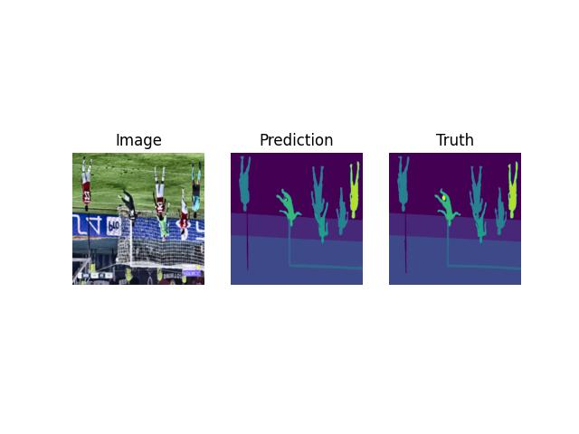

challenge Football (Semantic Segmentation) 
Dataset source : [Kaggle Link to dataset](https://www.kaggle.com/datasets/sadhliroomyprime/football-semantic-segmentation/data)


100 frames of pixel-perfect semantic segmentation with 11 classes.
- developed for the FIFA 2022 in Qatar 
- 100 frames taken at every 12th frame (match between Real Madrid and Manchester United) 

11 standard classes: `Goal Bar`, `Referee`, `Advertisement`, `Ground`, `Ball`, `Coaches and Officials`, `Audience`, `Goalkeeper A`, `Goalkeeper B`, `Team A`, and `Team B`. 

- used superAnnotate's pixel editor to label and classify images 
- dataset created by ACME AI Ltd. 
- contains COCO for optimized interoperability and visual understanding.

From data analysis, I found that the class had the following RGB values and have assigned the corresponding index

| Class | RGB Value | Index |
| --------- | --------- | --------- |
| Ground | [ 137,  126, 126] | 0 |
| Advertisement | [27,  71, 151] | 1 |
| Audience | [111,   48,  253] | 2 |
| Football Bar | [255,   0,  29] | 3 |
| Team A | [255,   160,  1] | 4 |
| Goalkeeper A | [255,   159,  0] | 5 |
| Team B | [254,   233,  3] | 6 |
| Goalkeeper B | [255,   235,  0] | 7 |
| Referee | [238,   171,  171] | 8 |
| Football | [201,   19,  223] | 9 |

The mask with the index can be extracted by running the cell named as `Data Extraction cell` or the python script:

```bash 
$ python ./extract_label_masks.py
```

### Train A model 
You can train a model by running the `train.py` file. 
```bash
python ./train.py
```
You can set the parameters such as `image size`, `epochs`, `batch size`, `learning rate`, `no of classes`, `device (cuda or cpu)` and `pretrain`, which are defined in `train.py`. Furthermore, you can also specify the types of transformations to apply to your training dataset.

The training logs are also generated to folder specified in `save_dirs`. 


### infer
To infer the result using the model you can run the inference file that take the videos in video, or you can pass your own video. The generated output will be saved in the `iteration_path`

```bash
# inference file
$ python ./video_infer.py
```

### prediction of exp-c-optim/iteration-5
The training log is provided in `exp-c-optim/iteration-5`. And the results:




the original video


Infer video 
